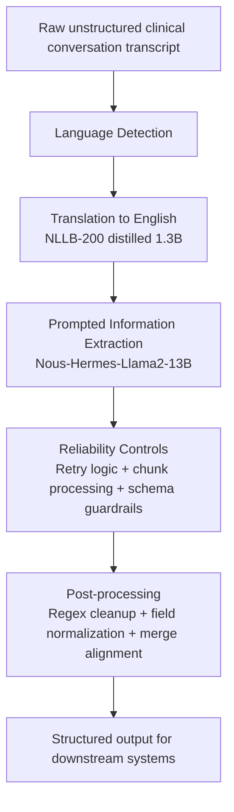

# 2023 Data4Good Case Competiton: End-to-End Medical Information Extraction with Open-Source LLMs

An end-to-end LLMs workflow that converts raw clinical transcripts into structured, system-ready records.  
Case competition info:  
- https://business.purdue.edu/events/data4good/
- https://business.purdue.edu/journal/24/s/stories/data4good.php

## Overview

- Built a LLM pipeline to turn messy, multilingual clinical conversations into clean, structured medical records.
- Converted 2,001 transcripts → 12,006 standardized records ready for downstream systems.
- Guaranteed a fixed 6-field schema (name, age, condition, symptoms, advised precautions, prescribed drugs) so outputs are consistent and database-consumable.
- Combined open-source Large Language Models, hosted inference, and deterministic post-processing (regex + rule-based normalization).

## Workflow

## Practical Problem Solved

Healthcare notes are often unstructured, noisy, and sometimes multilingual. That makes manual extraction slow and error-prone.

This project solves that by:
- translating non-English notes before extraction,
- constraining LLM output into a fixed 6-field schema,
- applying deterministic cleanup so outputs are immediately database-consumable.

## Technical Highlights

### NLP and LLM Engineering
- Prompt engineering with few-shot examples for noisy medical text.
- Multilingual preprocessing and translation pipeline design.
- Structured extraction from free-form text with schema-constrained outputs.

### Reliability and Production Thinking
- Chunked batch inference for long-running workloads.
- Retry logic and output validation to handle API/model variability.
- Deterministic post-processing to enforce formatting guarantees.

### Data and Analytics Engineering
- Pandas-based transformation pipeline across JSON and CSV artifacts.
- Key-based alignment between extracted outputs and test schema.
- Data quality checks for missingness, row consistency, and contract compliance.

### Output Contract

Each transcript is converted into exactly 6 entries for downstream processing:
1. Patient name
2. Patient age (numeric only)
3. Condition
4. Symptoms
5. Precautionary advice
6. Medication
