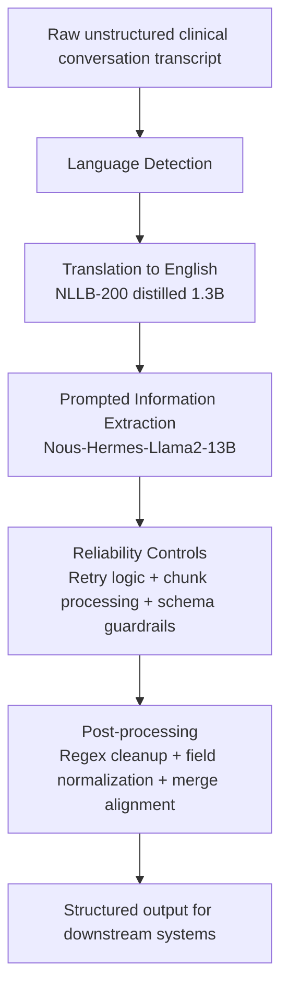

# 2023 Data4Good Case Competiton: End-to-End Medical Information Extraction with Open-Source LLMs

An end-to-end LLM workflow that converts raw clinical transcripts into structured, system-ready records.  
Case competition info:  
- https://business.purdue.edu/events/data4good/
- https://business.purdue.edu/journal/24/s/stories/data4good.php

## Overview

- LLM pipeline that turns messy, multilingual clinical conversations into structured medical records
- Converted 2,001 transcripts → 12,006 standardized records ready for downstream systems
- Combined open-source Large Language Models, hosted inference, and deterministic post-processing (regex + rule-based normalization)

## Example
### **Transcript**:  
_D: Good morning, Lucy. How can I help you today?_

_P: Hi, Doctor. I've been having these headaches that make my vision blurry and distorted._ 

_D: I see that you have a history of migraines, Lucy. Based on your symptoms, it seems like you might be experiencing another one._

_P: Yes, that's right. And my appetite has increased a lot lately too. It's making me feel very hungry all the time._

_D: Those are common symptoms of migraines. Additionally, you might experience visual disturbances such as auras or flashes of light._

_P: Yes, that's also happening to me. It's really frustrating and uncomfortable._

_D: I understand, Lucy. To help manage your migraines, I would recommend practicing meditation and reducing your stress levels. You can also use polarized glasses when you're outside to help reduce glare and brightness._

_P: Ok, I'll try that. And what about medication?_

_D: I would prescribe Fiorinal for you to take as needed for your migraines. Make sure to take it at the first sign of a headache to get the best results._

_P: Alright, thank you, Doctor._

_D: You're welcome, Lucy. If your symptoms worsen or don't improve within a week, please come back for a follow-up appointment._  

### **AI extracted:**  
- Patient Name: Lucy  
- Age: None  
- Condition: migraines  
- Symptoms: headaches that make vision blurry and distorted, increased appetite, feeling very hungry all the time, visual disturbances such as auras or flashes of light  
- Precautionary advice: practicing meditation and reducing stress levels, using polarized glasses when outside to help reduce glare and brightness  
- Medication: Fiorinal  

## Workflow

```mermaid
flowchart TD
    A[Raw unstructured clinical conversation transcript] --> B[Language Detection]
    B --> C[Translation to English<br/>NLLB-200 distilled 1.3B]
    C --> D[Prompted Information Extraction<br/>Nous-Hermes-Llama2-13B]
    D --> E[Reliability Controls<br/>Retry logic + chunk processing + schema guardrails]
    E --> F[Post-processing<br/>Regex cleanup + field normalization + merge alignment]
    F --> G[Structured output for downstream systems]
```

## Technical Highlights

### NLP and LLM Engineering
- Prompt engineering with few-shot examples
- Multilingual preprocessing and translation pipeline design
- Structured extraction from free-form text with schema-constrained outputs

### Output Contract

Each transcript is converted into exactly 6 entries for downstream processing:
1. Patient name
2. Patient age
3. Condition
4. Symptoms
5. Precautionary advice
6. Medication
