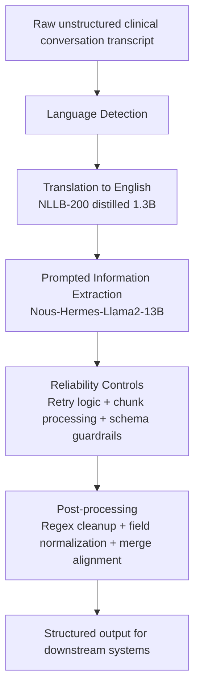

# 2023 Data4Good Case Competiton: End-to-End Medical Information Extraction with Open-Source LLMs

An end-to-end LLM workflow that converts raw clinical transcripts into structured, system-ready records.  
Case competition info:  
- https://business.purdue.edu/events/data4good/
- https://business.purdue.edu/journal/24/s/stories/data4good.php

## Overview

- LLM pipeline that turns messy, multilingual clinical conversations into structured medical records
- Converted 2,001 transcripts → 12,006 standardized records ready for downstream systems
- Combined open-source Large Language Models, hosted inference, and deterministic post-processing (regex + rule-based normalization)

## Workflow

```mermaid
flowchart TD
    A[Raw unstructured clinical conversation transcript] --> B[Language Detection]
    B --> C[Translation to English<br/>NLLB-200 distilled 1.3B]
    C --> D[Prompted Information Extraction<br/>Nous-Hermes-Llama2-13B]
    D --> E[Reliability Controls<br/>Retry logic + chunk processing + schema guardrails]
    E --> F[Post-processing<br/>Regex cleanup + field normalization + merge alignment]
    F --> G[Structured output for downstream systems]
```

## Technical Highlights

### NLP and LLM Engineering
- Prompt engineering with few-shot examples
- Multilingual preprocessing and translation pipeline design
- Structured extraction from free-form text with schema-constrained outputs

### Output Contract

Each transcript is converted into exactly 6 entries for downstream processing:
1. Patient name
2. Patient age (numeric only)
3. Condition
4. Symptoms
5. Precautionary advice
6. Medication
